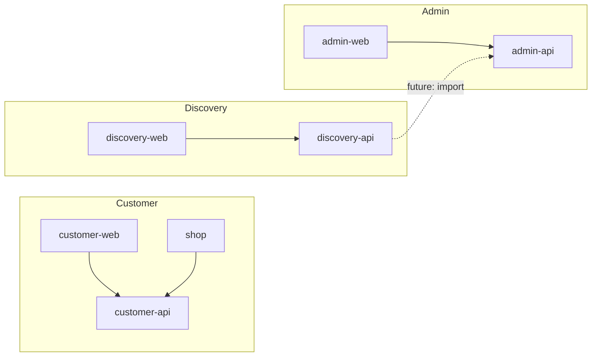

# Next Potential Todo Tasks

A prioritized list of features, architecture improvements, and e-commerce enhancements. Covers **customer** (customer-web, shop, customer-api), **admin** (admin-web, admin-api), and **discovery** (discovery-web, discovery-api) areas.

**Status:** ✅ Fully completed (all relevant apps) | 🔶 Partially completed (some apps or some parts) | ⬜ Not started

---

## 1. E-commerce Features (Customer-Facing)

| Status | Task | Description | Effort |
|--------|------|-------------|--------|
| ✅ | **Wishlist / Saved Items** | Save products for later; sync when logged in. Done: customer-api, customer-web, shop. | Medium |
| 🔶 | **Product Search** | Full-text search (name, description, brand). Partial: simple name ILIKE in customer-api `/products`. Remaining: FTS5 or Elasticsearch/Meilisearch. | Medium |
| 🔶 | **Order Tracking** | Real-time status updates. Partial: admin can set status; customer sees it. Remaining: tracking number field, carrier API, customer notifications. | Medium |
| ⬜ | **Promotions / Discounts** | Coupon codes, percentage/fixed discounts, BOGO. New models: Promotion, Coupon. Apply at checkout. customer-api, customer-web, shop. | Medium–High |
| ⬜ | **Returns & Refunds** | Return request flow, refund via Stripe, restocking. admin-api, admin-web, customer-api. | High |
| ⬜ | **Low Stock Alerts** | Notify users when out-of-stock items are back. customer-api + email/push + background jobs. | Medium |
| ⬜ | **Recently Viewed** | Last N viewed products (localStorage or backend). customer-web, shop. | Low |
| ⬜ | **Related Products** | "You may also like" by category, brand, or history. customer-api, customer-web, shop. | Low–Medium |
| ⬜ | **Order History Export** | Download order history as CSV/PDF. customer-api, customer-web, shop. | Low |
| ⬜ | **Email Notifications** | Order confirmation, shipping updates, password reset. customer-api + email service (SendGrid, SES). | Medium |

---

## 2. E-commerce Features (Admin)

| Status | Task | Description | Effort |
|--------|------|-------------|--------|
| 🔶 | **Dashboard Analytics** | Sales overview, top products, revenue trends. Partial: basic dashboard (order/product count). Remaining: charts (e.g. Recharts), revenue by period. admin-web. | Medium |
| ⬜ | **Inventory Alerts** | Admin notification when stock below threshold; low-stock report. admin-api, admin-web. | Low |
| 🔶 | **Bulk Operations** | Bulk edit (price, category, stock), bulk export (CSV). Partial: bulk import + BulkUploadsPage done. Remaining: bulk edit, export. admin-api, admin-web. | Medium |
| ⬜ | **Promotions CRUD** | Admin UI to create and manage coupons and promotions. admin-api, admin-web. | Medium |
| ⬜ | **Customer Management** | List customers, view order history, impersonate or support actions. admin-api, admin-web. | Medium |
| 🔶 | **Order Fulfillment Flow** | Mark shipped, tracking number, customer notification. Partial: status update and stock release on shipped. Remaining: tracking number field, notification. admin-api, admin-web. | Medium |
| ⬜ | **Reporting** | Sales by period, category, brand; export reports. admin-api, admin-web. | Medium |

---

## 3. Discovery System (discovery-api & discovery-web)

| Status | Task | Description | Effort |
|--------|------|-------------|--------|
| ✅ | **Discovery pipeline (scaffold)** | API + DB + mock strategy, list products, list strategies, POST runs. Done: discovery-api, discovery-web (list, filters, run trigger). | — |
| ⬜ | **Real strategies (discovery-api)** | Document or implement one real source (Apify, SerpApi, or custom scraper); keep mock for tests. | Medium |
| ⬜ | **Scheduled runs (discovery-api)** | Cron or worker calling POST /v1/runs periodically (e.g. daily). | Low–Medium |
| ⬜ | **Import to catalog (discovery-api + admin-api)** | "Import to catalog" action: discovery-api or discovery-web calls admin-api to create product from discovered item. | Medium |
| ⬜ | **Auth for discovery API** | API key or admin JWT so only authorized clients can trigger runs or read data. discovery-api, optionally discovery-web. | Low–Medium |
| ⬜ | **Structured logging & request ID (discovery-api)** | structlog and request_id middleware; parity with admin-api/customer-api. | Low |
| ⬜ | **Health with DB check (discovery-api)** | GET /health verifies DB connectivity; return app, version, checks (like admin-api). | Low |
| ⬜ | **Pagination metadata (discovery-api)** | GET /v1/products returns total count or next cursor. | Low |
| ⬜ | **Strategy enable/disable from DB (discovery-api)** | Use strategies table for enable/disable; replace hardcoded list. | Low |
| ⬜ | **Design system parity (discovery-web)** | Use @ecommerce/design-tokens and Tailwind so discovery-web matches admin-web/customer-web. | Low–Medium |
| ⬜ | **Layout and navigation (discovery-web)** | Layout with nav (Products, Strategies, Run history) and Outlet for future pages. | Low |
| ⬜ | **Skeleton loading (discovery-web)** | Product-grid skeleton instead of "Loading products…"; match project loading rules. | Low |
| ⬜ | **Empty and error states (discovery-web)** | Consistent empty-state and error-state UI; align with Design System section. | Low |
| ⬜ | **Run history view (discovery-api + discovery-web)** | Backend: endpoint for recent runs; frontend: page or section listing run_id, strategy_id, count, timestamp. | Medium |
| ⬜ | **Strategies page (discovery-web)** | Dedicated page for strategy list and enable/disable when backend supports it. | Low |
| ⬜ | **Optional auth (discovery-web)** | Login or API-key gate when discovery-api has auth. | Medium |

---

## 4. System Architecture Enhancements

| Status | Task | Description | Effort |
|--------|------|-------------|--------|
| ⬜ | **Database Migrations** | Alembic migrations for incremental schema changes (customer-api, admin-api; optionally discovery-api). Replace reset_and_seed-only where needed. | Medium |
| ⬜ | **Caching** | Redis for product list, session, or i18n. Redis in Docker profile exists; no app usage yet. customer-api, admin-api. | Medium |
| 🔶 | **Background Jobs** | Async tasks (emails, stock sync, reports). Partial: bulk-import worker only. Remaining: Celery or ARQ for broader use. | Medium–High |
| ⬜ | **Rate Limiting** | Throttle auth, checkout, public endpoints. customer-api (BFF has per-IP; auth/checkout could be added), admin-api. | Low |
| ⬜ | **Feature Flags** | Toggle features (promotions, wishlist) without deploy. Shared or per-app. | Medium |
| ⬜ | **Event-Driven Updates** | Publish order/stock events; consumers for notifications, analytics. | High |
| ⬜ | **Read Replicas** | Split read/write for product catalog at scale. | High |

---

## 5. Security & Compliance

| Status | Task | Description | Effort |
|--------|------|-------------|--------|
| ⬜ | **GDPR / Privacy** | Data export, right to deletion, cookie consent, privacy policy. customer-api, customer-web, shop. | Medium |

---

## 6. UX & Frontend (All Frontends)

| Status | Task | Description | Effort |
|--------|------|-------------|--------|
| 🔶 | **Skeleton Loading** | Skeletons for product cards and PDP. Done: customer-web, admin-web, shop. Pending: discovery-web. | Low |
| ✅ | **Image Optimization** | Lazy loading, responsive images, Next.js Image / expo-image, CDN. Done: customer-web, admin-web, shop. | Low–Medium |
| ⬜ | **Offline Support (Shop)** | Cache product list/cart for limited offline use (AsyncStorage). shop only. | Medium |
| ⬜ | **Push Notifications (Shop)** | Order and promotion notifications via Expo Push. shop only. | Medium |
| 🔶 | **Accessibility (a11y)** | ARIA labels, keyboard nav, focus management, screen readers. Partial: minimal aria/role/alt. Applies: customer-web, admin-web, shop, discovery-web. | Medium |
| 🔶 | **Error Boundaries** | Graceful error UI instead of blank screens. Done: shop. Pending: customer-web, admin-web, discovery-web. | Low |
| ⬜ | **Analytics** | Track key events (add to cart, checkout start, purchase). customer-web, shop; optionally admin-web. | Low–Medium |

---

## 7. DevOps & Deployment

| Status | Task | Description | Effort |
|--------|------|-------------|--------|
| ⬜ | **PostgreSQL Migration** | Move from SQLite to PostgreSQL for production (customer-api, admin-api; see PRODUCTION.md). | Medium |
| ✅ | **Docker Compose** | All services in containers: customer-api, admin-api, customer-web, admin-web, discovery-api, discovery-web, bulk-import worker, init. | — |
| ⬜ | **CI/CD** | GitHub Actions for lint, test, build; deploy to Render/Vercel. | Medium |
| ⬜ | **E2E Tests** | Playwright or Cypress for critical flows (checkout, login). customer-web, admin-web. | Medium |
| ⬜ | **Environment Parity** | Staging env that mirrors production. | Low–Medium |

---

## 8. Additional Features (Expanded)

| Status | Task | Description | Effort |
|--------|------|-------------|--------|
| ⬜ | **Product Compare** | Compare up to N products (specs, price) side by side. customer-web, shop. | Low–Medium |
| ⬜ | **Guest Checkout** | Checkout without account; optional "create account after" with order link. customer-api, customer-web, shop. | Medium |
| ⬜ | **Multiple Currencies** | Display and optionally charge in multiple currencies; exchange rates. customer-api, customer-web, shop. | Medium–High |
| ⬜ | **Product Q&A / Reviews Moderation** | Admin queue to approve/reject reviews; optional Q&A on PDP. admin-api, admin-web, customer-api, customer-web, shop. | Low–Medium |
| ⬜ | **Saved Carts** | Persist cart for logged-in users across devices. customer-api, customer-web, shop. | Low |
| ⬜ | **Subscription / Recurring** | Subscribe-and-save or recurring orders. customer-api, admin-api, customer-web, shop. | High |

---

## 9. Optimizations

| Status | Task | Description | Effort |
|--------|------|-------------|--------|
| ⬜ | **API Response Compression** | Gzip/Brotli for JSON. customer-api, admin-api, discovery-api. | Low |
| ⬜ | **Query & N+1 Reduction** | Eager load relations in product list, order detail; avoid N+1 in filters. customer-api, admin-api. | Low–Medium |
| ⬜ | **Frontend Bundle & Code Splitting** | Lazy-load routes and heavy components. customer-web, admin-web, shop, discovery-web. | Low–Medium |
| ⬜ | **DB Indexing Review** | Indexes on slug, status, created_at, filter columns. customer-api, admin-api, discovery-api. | Low |
| ⬜ | **Static Asset CDN** | Product images and static assets via CDN with cache headers. | Low–Medium |

---

## 10. Scalability & Reliability

| Status | Task | Description | Effort |
|--------|------|-------------|--------|
| ✅ | **Idempotency for Orders / Payment** | Idempotency keys for order creation and payment intent. Done: customer-api, customer-web, shop. | Medium |
| ⬜ | **Health & Readiness Probes** | Liveness vs readiness (e.g. DB connectivity); use in Docker/Kubernetes. customer-api, admin-api, discovery-api. | Low |
| ✅ | **Structured Retries** | Retry with backoff for DB and external calls. Done: customer-api (Stripe, etc.). | Low–Medium |
| ✅ | **Request Timeouts** | Consistent timeouts on outbound HTTP and DB. Done: customer-api, admin-api; frontend axios 30s. | Low |
| ⬜ | **Circuit Breaker (Optional)** | For external services (payment, email) to fail fast when unhealthy. | Medium |

---

## 11. Security Hardening

| Status | Task | Description | Effort |
|--------|------|-------------|--------|
| ⬜ | **CSRF / Same-Site** | State-changing operations use CSRF tokens or SameSite cookies. customer-api, admin-api. | Low–Medium |
| ⬜ | **Input Sanitization** | Sanitize rich text / user-generated content to prevent XSS. customer-api, admin-api. | Low |
| ⬜ | **Secrets Rotation** | Document and support rotation of JWT secret, DB credentials, API keys. | Low |
| ⬜ | **Audit Log Retention** | Policy and tooling for audit log retention and secure access. admin-api, customer-api. | Low |
| ⬜ | **Dependency Scanning** | Dependabot or similar; npm/pip audit in CI. All apps. | Low |

---

## 12. Design System & UI/UX

| Status | Task | Description | Effort |
|--------|------|-------------|--------|
| 🔶 | **Design Tokens as Single Source** | Single source (packages/design-tokens); consume in apps. Done: customer-web, admin-web, shop. Pending: discovery-web. | — |
| ⬜ | **Dark Mode** | Full dark theme. customer-web, shop; optionally admin-web, discovery-web. | Medium |
| ⬜ | **Mobile-First Admin** | Responsive or dedicated mobile view for admin. admin-web. | Medium |
| ⬜ | **Empty & Error States** | Consistent empty-state and error-state illustrations/copy. customer-web, admin-web, shop, discovery-web. | Low |
| 🔶 | **Loading & Transition Consistency** | Unified loading and transition rules. Done: customer-web, admin-web, shop. Pending: discovery-web (skeleton, transitions). | — |

---

## 13. Architectural

| Status | Task | Description | Effort |
|--------|------|-------------|--------|
| ✅ | **API Gateway / BFF** | customer-bff: proxy, rate limit, GET /v1/checkout-context. Docker port 8012. | High |
| 🔶 | **Structured Logging & Tracing** | Request IDs; optional OpenTelemetry. Done: customer-api, admin-api, BFF (forwards X-Request-ID). Pending: discovery-api. | Medium |
| ⬜ | **Config Service** | Centralized config (feature flags, limits) without code deploy. | Medium |
| ⬜ | **Service Boundaries Doc** | Clear ownership: customer-api vs admin-api vs discovery-api; shared DB contract and evolution. | Low |

---

## 14. Discovery vs Admin/Customer – Comparison Reference

Reference only (not a task list). Use for parity work.

### Backend (discovery-api vs admin-api / customer-api)

| Aspect | Admin/Customer APIs | Discovery API | Suggested improvement |
|--------|---------------------|---------------|------------------------|
| **Logging** | structlog + RequestIdMiddleware | None | Add structlog and request_id (Section 3). |
| **Security** | SecurityHeadersMiddleware, CORS from config, HTTPS redirect | CORS `*` only | Add security headers; CORS from config. |
| **Telemetry** | Optional OpenTelemetry (trace_id/span_id, OTLP) | None | Optional OTel for consistency. |
| **Health** | DB check, app, version, checks | `{"status":"ok"}` only | Add DB connectivity and checks (Section 3). |
| **Config** | Rich (CORS, SECRET_KEY, CSP) | Minimal | Add CORS list, optional env for production. |

### Frontend (discovery-web vs admin-web)

| Aspect | Admin-web | Discovery-web | Suggested improvement |
|--------|-----------|---------------|------------------------|
| **Design system** | @ecommerce/design-tokens, Tailwind, theme.css | Plain CSS, inline styles | Add design-tokens + Tailwind (Section 3). |
| **Layout** | Layout with sidebar nav, Outlet | Single full-page | Add Layout + nav. |
| **Auth** | Login, ProtectedRoute, useAuthStore | None | Optional when API is protected. |
| **HTTP client** | axios (timeout, interceptors) | fetch in api.ts | Consider axios for consistency. |
| **Loading** | PageLoader, TableSkeleton | "Loading products…" text | Skeleton for product grid. |
| **Icons** | lucide-react | None | Add lucide-react. |

---

## Suggested Priority Order

1. **Quick wins:** Recently viewed, low-stock admin alerts, health/readiness refinement, rate limiting, error boundaries (customer-web, admin-web, discovery-web).
2. **High impact:** Promotions, email notifications, dashboard analytics, tracking number + fulfillment UX.
3. **Foundation:** Database migrations, caching, background jobs.
4. **Discovery:** Design parity (tokens, layout, skeleton) and backend parity (logging, health, CORS) for discovery; then real strategies, run history, import to catalog.
5. **Scale:** Full-text search (FTS5 or Elasticsearch/Meilisearch), event-driven design.
6. **Polish:** Returns/refunds, push notifications, a11y, analytics, dark mode.

---

## Changelog (Implemented)

| Date | Change |
|------|--------|
| 2025-02-10 | **NEXT_TODO rewrite:** Full document restructure. Single table per section; Discovery (Section 3) same format as others. Deduplicated tasks with explicit app scope (customer-web, admin-web, shop, customer-api, admin-api, discovery-api, discovery-web). Status clarified: ✅ fully completed (all relevant apps), 🔶 partial (some apps or parts), ⬜ not started. Section 14 kept as comparison reference only. |
| 2025-02-10 | **NEXT_TODO:** Added Section 13 (Discovery backend/frontend features), Section 14 (Discovery vs Admin/Customer comparison); updated Suggested Priority and intro. |
| 2025-02-09 | **API Gateway/BFF and structured logging & tracing:** customer-bff (proxy to customer-api, rate limiting, GET /v1/checkout-context). Request ID in structlog context; optional OpenTelemetry in customer-api and admin-api; BFF forwards X-Request-ID. ARCHITECTURE, docs/DOCKER, docker-compose updated. |
| 2025-02-09 | **Idempotency, retries, timeouts:** Idempotency keys for orders and payment intents (table, header); Stripe retries with tenacity; DB and Stripe timeouts; frontend axios 30s. |
| 2025-02-09 | **Loading and transition consistency:** PageLoader, ProductCardSkeleton, PdpSkeleton (customer-web); TableSkeleton, PageLoader (admin-web); FullScreenLoader, ProductCardSkeleton (shop). Skeleton for product grid, PDP, tables; spinner for full-page/inline. Button/card transitions (active:scale, duration-500). DESIGN_TEMPLATE.md and rules updated. |
| 2025-02-09 | **Design tokens single source:** Added `packages/design-tokens` with `tokens.json`, codegen for `dist/theme.css`, and JS export. Root npm workspaces; customer-web and admin-web import theme CSS; shop uses package in `constants/Colors.ts`. Rule added: token changes only in `packages/design-tokens`. |
| 2025-02-09 | **NEXT_TODO audit:** Added implementation status (✅/🔶/⬜) to all existing items. Classified: Product Search (partial – name ILIKE), Order Tracking (partial – status only), Dashboard (partial – counts only), Bulk Ops (partial – import done), Order Fulfillment (partial – status + stock), Background Jobs (partial – bulk worker), a11y (partial), Error Boundaries (partial – Shop only), Docker Compose (done). Expanded list with new sections: Additional Features, Optimizations, Scalability & Reliability, Security Hardening, Design System & UI/UX, Architectural. |
| 2025-02-09 | **Plan verification:** Added audit_log to reset_and_seed imports for table creation; added phone pattern to AddressCreate/AddressUpdate; created .env.example for customer-web and shop with API URL vars. Frontends (customer-web, shop, admin-web) verified: baseURL and proxy/rewrite point to /v1. |
| 2025-02-08 | **Security & Infrastructure:** HTTPS redirect, security headers, input validation (Pydantic Field constraints), audit logging (admin + customer actions), API versioning (/v1 prefix), structured logging (structlog, request ID), health checks with DB connectivity. Removed from todo list above. |

*Last updated: 2025-02-10 (Full rewrite: structure, deduplication, status)*
